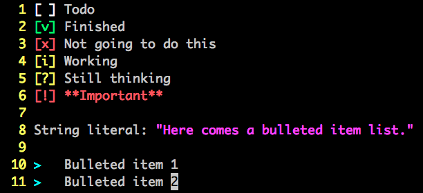

================
Todo or not todo
================

A plugin for you to manage your TODOs, or NOT TODOs.

This project is still at an early development stage, many features are not customizable yet.

Ideas, issues and many other things are appreciated!

Installation
------------

Use Vundle_

..  _Vundle: https://github.com/VundleVim/Vundle.vim

Key Mappings
------------

These mappings should finally be customizable.

Customizable mappings:

* [normal][insert][visual] ``<C-c>``: switch between checkboxes.

  - Customize with ``g:todo_loop_checkbox``

* [normal][insert][visual] ``<leader>b``: set current line a bulleted item, checkbox will be destroyed.

  - Customize with ``g:todo_set_bullet``

Default mappings:

* [normal] ``>`` ``<``: increase and decrease indent
* [visual] ``>`` ``<``: increase and decrease indent of selected lines
* [normal] ``o``: open a new line with bullet
* [insert] ``<CR>``: create a new bulleted item in new line, same indent
* [normal] ``I``: insert text at logical line start
* [normal] ``^``: move cursor to line start smartly
* [normal] ``J``: join two lines, bullet or checkbox on next line will de destroyed
* [insert] ``<TAB>``, ``<S-TAB>``: if cursor is at line start, increase/decrease indent
* [insert] ``<C-d>``, ``<C-t>``: decrease/increase indent of current line

Customizable Settings
---------------------

Checkboxes
~~~~~~~~~~

Checkboxes are seperated into two types ::

  [ ][v][x] [i][?][!]

These checkboxes are recognized by this plugin, i.e. they are colorized and can be switched with ``<C-c>``.

Depend on their type, ``<C-c>`` changes them in different way:

* If your cursor is on a bulleted item, press ``<C-c>`` makes that bullet a ``[ ]``
* If your cursor is on the same line with ``[ ]``, ``[v]`` or ``[x]``, ``<C-c>`` makes them the next one (round-robin)
* If your cursor is on the same line with ``[i]``, ``[?]`` or ``[!]``, ``<C-c>`` makes them a ``[ ]``

To add a checkbox, stick this into your vimrc:

..  code-block:: vim

    call todo#add#checkbox('[ ]', 'White')

This checkbox can be looped with ``<C-c>``.

To add a checkbox without participated in ``<C-c>`` loop, add a ``0`` as the third argument:

..  code-block:: vim

    call todo#add#checkbox('[i]', 'LightYellow', 0)

Here is the default settings of this plugin:

..  code-block:: vim

    call todo#add#checkbox('[ ]', 'White')
    call todo#add#checkbox('[v]', 'LightGreen')
    call todo#add#checkbox('[x]', 'LightRed')
    call todo#add#checkbox('[i]', 'LightYellow', 0)
    call todo#add#checkbox('[?]', 'LightYellow', 0)
    call todo#add#checkbox('[!]', 'LightRed', 0)

And if you prefer to use unicode checkboxes:

..  code-block:: vim

    call todo#add#checkbox('☐', 'white')
    call todo#add#checkbox('☑', 'green')
    call todo#add#checkbox('☒', 'red')

The color strings are evaluated into argument ``ctermfg``, if you are new to vim, you can pick colors here:

* Black
* DarkBlue
* DarkGreen
* DarkCyan
* DarkRed
* DarkMagenta
* Brown, DarkYellow
* LightGray, LightGrey, Gray, Grey
* DarkGray, DarkGrey
* Blue, LightBlue
* Green, LightGreen
* Cyan, LightCyan
* Red, LightRed
* Magenta, LightMagenta
* Yellow, LightYellow
* White

Note: *Once you called todo#add#checkbox(), all the built-in checkboxes are disabled.*

Bullets
~~~~~~~

Currently only one kind of bullets supported:

..  code-block:: vim

    let g:todo_bullet = '>'

Colors
~~~~~~

You can assign color of certain patterns:

..  code-block:: vim

    let g:todo_bullet_color = 'LightCyan'
    let g:todo_url_color = 'LightCyan'
    let g:todo_comment_prefix = '\v(^| )#'
    let g:todo_comment_color = 'LightCyan'

Currently only foreground color setting supported, no underline or background color yet.

Screenshot
----------

License
-------

This project in released under WTFPL Version 2.
